## Introdução


## Tópicos

- O que é um Data Lake?
- O que é compreensão?
- Porque devemos usar o formato Parquet?
- Porque devemos particionar nossos data sets?


## O que é um Data Lake?

Atualmente é colocar os arquivos na Cloud.
Mas antigamente...

E aí, tem os competidores desse paradignma
O Apache Iceberg
o Delta Lake
o Hudi
competidores da abstração no topo dos arquivos na Cloud


Não é apenas um "pantano" 


- O que é compreensão? 


Compreensão é uma maneira de reduzir o tamanho dos arquivos.

Tem dois tipos de compreensão:

Lossy: com perdas
Reduz o tamanho dos dados às custas de alguma correção dos dados.
Comum com processamento de vídeo, imagem e áudio


Lossless: sem perdas

Reduz o tamanho dos dados sem prejudicar a correção dos dados.
Comum com processamento de dados tabulares e codificação

Uma técnica de compreensão sem perdas é tudo que você precisa saber no mundo do Data Lake.


## Apache Iceberg

### Links para ver depois / Rever
https://www.linkedin.com/pulse/deep-intro-apache-iceberg-resources-learning-more-alex-merced-dchoe/


### O que é o Iceberg?

Iceberg é um padrão aberto para tabelas com comportamento SQL.
A ideia central do Iceberg seria aplicar os fundamentos dos bancos de dados na engenharia de dados. Fazendo com que as tabelas funcionassem como um abstração que você não precisa se preocupar com o que está por trás.

O apache iceberg tem esse príncipio filosofico que ele deveria ser invisível. 
Dessa forma, o iceberg seria invisível, não veríamos tudo que está abaixo do nível do oceano, somente a "ponta do iceberg".
Com isso, evitaríamos surpresas desagradáveis, como fazer mudanças simples em sua tabela e então você corromper todo os seus dados por todo o tempo. E então você ter que arrumá-los.

E sutilmente, 
e reduziríamos o contexto da mudança. como por exemplo, imaginar o tamanho da tabela daqui 1 ano quando você cria a tabela para manter tudo funcionando no futuro. 
Você não precisa ficar se preocupando com pequenos detalhes.

Forma mais simples: Atualizações confiáveis.
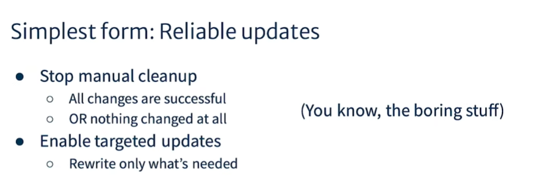

Caso de Uso:

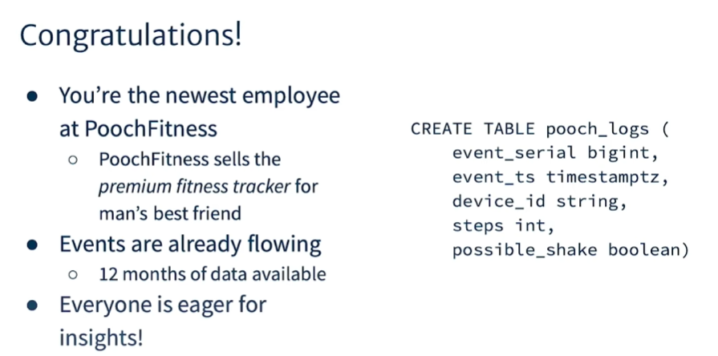


Lista de problemas:

Problem #1: Bad Data
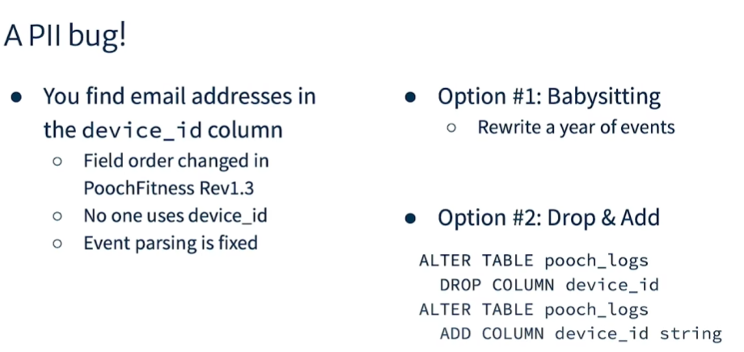
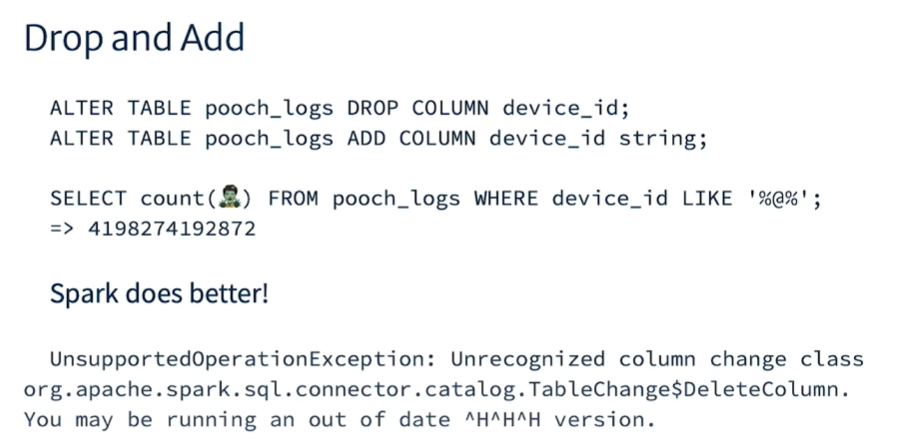
Beneficios do Schema Evolution

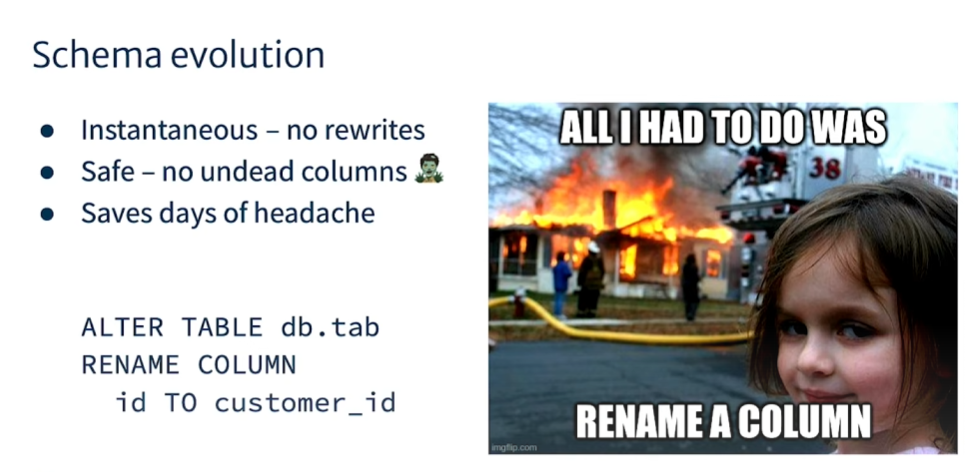


Problem #2: Slow queries
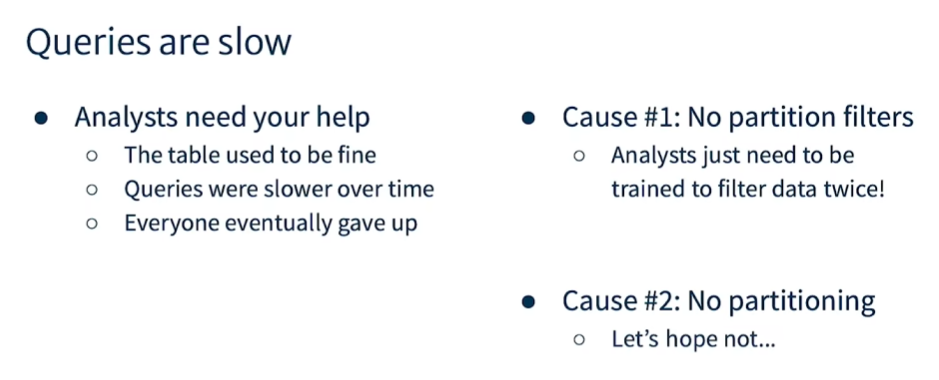

Os analistas não conhecem o layout, não sabem que devem fazer suas consultas com base no layout fisico.

A boa notícia é que com o Iceberg, temos o particionamento oculto.
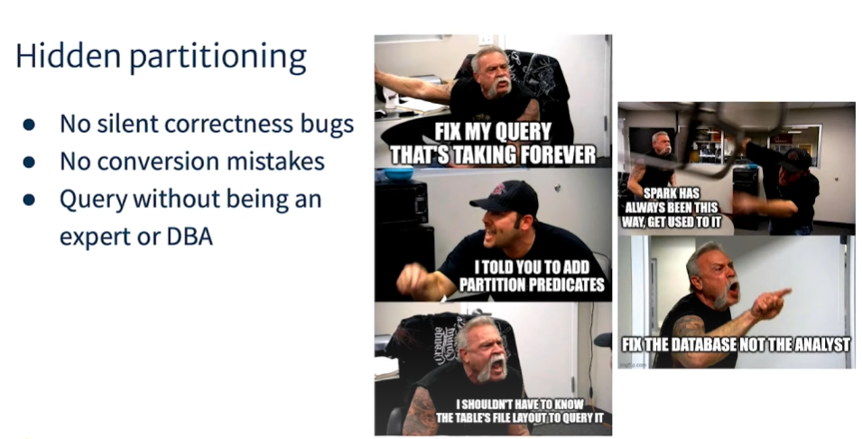


Problem #2: No partitions
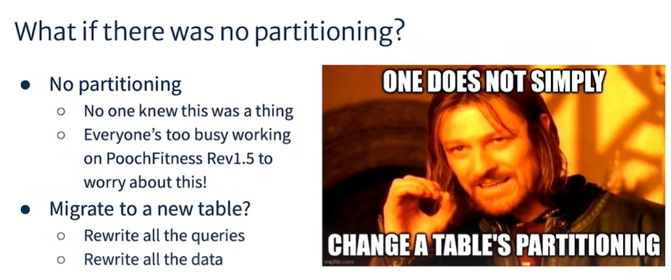

Layout Evolution
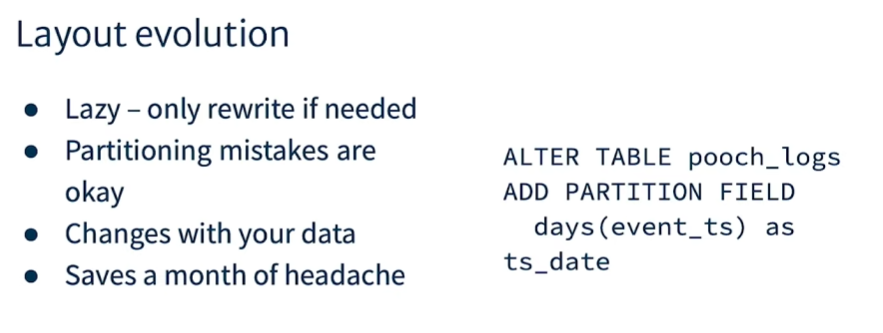

Iceberg,,,,
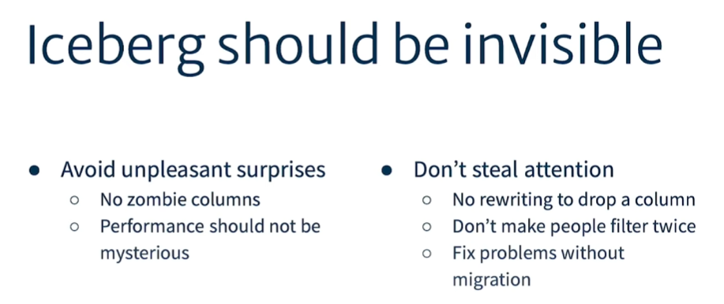


cenário de mudanças dos dados
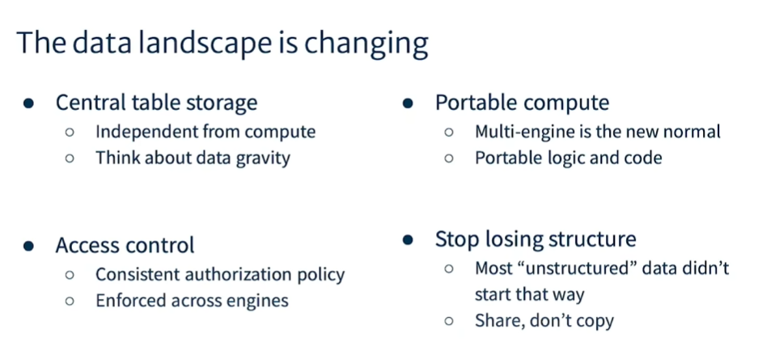


### Como funciona o Apache Iceberg?


O Apache Iceberg consiste em 4 componentes:

- **Iceberg Catalog**: Este componente rastreia a lista de tabelas e faz referência à localização dos metadados mais recentes, apontando especificamente para o arquivo metadata.json atual.
  
- **Metadata.json**: Este arquivo contém detalhes sobre a tabela, como esquema de particionamento, esquema e uma lista histórica de instantâneos.
  
- **Manifest List**: Cada lista de manifestos corresponde a um instantâneo e agrega estatísticas para cada manifesto que compreende o instantâneo. Esses metadados são usados ​​para aplicar remoção de partição, permitindo que consultas ignorem manifestos com valores de partição que são irrelevantes para a consulta.

- **Manifests**: Cada manifesto representa um pacote de arquivos de dados, juntamente com suas estatísticas, que podem ser usadas para filtragem mínima/máxima para ignorar arquivos que não contêm valores relevantes para a consulta.
  


<!-- 
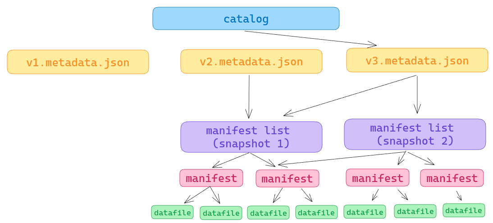

 -->

<p align="center">
    
</p>


Em última análise, essas camadas de metadados permitem que as ferramentas verifiquem a tabela com eficiência e excluam arquivos de dados desnecessários do plano de verificação.


Dessa forma, ele permite que você modifique suas tabelas com:
- Update
- Insert
- Delete
- Merge

E como funcionalidade adicional como: time travel e schema evolution.

Além disso, o Apache Iceberg é de alta performance e fácil manutenção.

O Iceberg armazena um estado para tabale (table state) em um snapshot, e a engine simplesmente precisa ler os metadados e esse snapshot começa a recuperar os dados do armazenamento, economizando tempo e reduzindo custos de recuperação de armazenamento de objetos na nuvem.

Recursos adicionais como: otimização de tabela, classificação de tabela, compactação, vacuuming, particionamento e retenção também aumenta o desempenho e  a facilidade de manutenção.

O formato de tabela Iceberg é formado por diferentes componentes.

Os data files
Manifest file
manifest list
metadata file
iceberg catalog

<p align="center">
    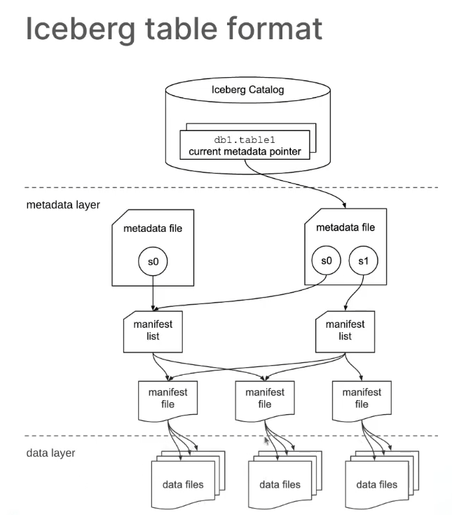
</p>

Com isso, o Iceberg atua a nível da camada de metadados, no topo do seus data files, para que a ferramenta entenda melhor os dados que você está trabalhando para melhor atender com qual funcionalidade você irá trabalhar.

Então, basicamente, vamos entender a nível da camada de metadados (metadata layer), onde não especifica como os arquivos de dados serão escritos e nem como o catálogo irá ser desenhado, pois tem diversas formas de como você pode catalogar suas tabelas iceberg. 

#### Catálogo do Iceberg

Trata-se de um local onde o atual ponteiro dos metadados serão apontados para as tabelas Iceberg, de forma que suporte operações atômicas para atualizar o ponteiro dos metadados atual.

E o que é o ponteiro de metadados atual da tabela?
O ponteiro de metadados atual da tabela é o mapeamento do nome da tabela para o local do arquivo de metadados atual.

Dessa forma, o Catalogo do Iceberg sempre levará ao arquivo de metadados atual de cada tabela, direcionando assim qualquer consumo referente as tabelas Iceberg.

#### Metadata File 

O Arquivo de metadados tem por sua função armazenar os metadados da tabela em um determinado momento. E arquivo nada mais é quem um arquivo json explicando de forma macro o que contém a tabela, como localizá-la, qual schema da tabela, como está particionada e qual snaptshot está utilizando no momento,como no exemplo abaixo.

```json
{
"table-uuid": "<uuid>",
"location": "/path/to/table/dir",
"schema": {...},
"partition-spec": [ {<partition-details>}, ...],
"current-snapshot-id": <snapshot-id>,
"snapshots": [{
  "snapshpt-id": <snapshot-id>,
  "manifest-list": "/path/to/manifest/list.avro"
}, ...],
}
```

Dessa forma, podemos entender como a tabela está agora, bem como também como foi no passado.

Então, quando você sabe qual snapshot você quer consultar, cada snapshot  é composto de vários "manifest list", que são um grupo de arquivos contendo o "manifest file". Essa lista de manifestos permite saber quais arquivos de manifestos pertecem à aquele snapshot.


#### Manifest List 

A lista de manifestos nada mais é que uma lista dos arquivos de manifestos (manifest file), possibilitando que o snapshot saiba o caminho do arquivo do manifesto, a qual snapshot pertence, qual partição está sendo coberta por esse manifesto e todas os metadados referentes a cada manifesto que poderão ser usados e que realmente importam para consulta, não considerando manifestos que não atendem, ou seja, não lendo arquivos que não precisam ser lidos, como no exemplo abaixo.


```json
{
"manifest-path": "/path/to/manifest/file.avro",
"added-snapshot-id": <snapshot-id>,
"partition-spec-id": <partition-spec-id>,
"partitions": [{partition-info}, ...],
...
}
{
"manifest-path": "/path/to/manifest/file2.avro",
"added-snapshot-id": <snapshot-id>,
"partition-spec-id": <partition-spec-id>,
"partitions": [{partition-info}, ...], 
...
}

```

#### Manifest Files

Os arquivos de manifestos são uma lista de arquivos de dados, que contém detalhes e estatísticas sobre cada arquivo de dados, como no exemplo abaixo.

```json
{
  "data-file": {
    "file-path": "/path/to/data/file.parquet",
    "file-format": "PARQUET",
    "partition": {"<part-field>": {"<data-type>": <valued>}},
    "record-count": <num-records>,
    "null-value-counts": [{
      "column-index": "1", "value": 4
    }, ...],
    "lower-bounds": [{
      "column-index": "1", "value": "aaa"
    }, ...],
    "upper-bounds": [{
      "column-index": "1", "value": "eee"
    }, ...],
  }
  ...
}
{
  ...
}

```
Com isso, o arquivo de manifesto procura por linhas que contêm dados sobre arquivos que fazem parte da tabela. Então, cada manifesto contém vários arquivos que irão conter os detalhes do arquivo, bem como onde estão localizados, qual é o tipo e o formato.

O Apache Iceberg suporta formatos de arquivos Parquet, Orc, Avro.

Lower e Upper bounds são referentes aos limites inferiores e superiores no Apache Iceberg, para que se possa otimizar consultas em tabelas particionadas.
Esses limites colaboram para o desempenho das consultas, de forma que o Iceberg direciona para partições que realmente contém dados, definindo o limite mínimo e máximo de dados em que uma consulta precisa ser realizada, economizando recursos de processamento, sendo útil para grandes volumes de dados particionados.


### Funcionalidades do Apache Iceberg

Os formatos de tabela do Data Lakehouse, como Apache Iceberg, Apache Hudi e Delta Lake, fornecem recursos essenciais para permitir transações ACID em data lakes, juntamente com a evolução do esquema e a viagem no tempo, que permitem consultar versões históricas de tabelas. No entanto, o Apache Iceberg oferece uma variedade de recursos exclusivos:


- **Evolução da Partição**: O Apache Iceberg rastreia o histórico de particionamento no arquivo metadata.json, permitindo que as tabelas alterem seu esquema de particionamento sem reescrever todo o conjunto de dados e metadados. Esse recurso econômico adiciona flexibilidade ao gerenciamento de tabelas.
  

- **Particionamento Oculto**: O Apache Iceberg rastreia partições não apenas pelo valor bruto de uma coluna, mas também por valores transformados. Essa abordagem elimina a necessidade de colunas extras dedicadas ao particionamento e reduz a necessidade de predicados adicionais nas consultas, simplificando a implementação da partição e minimizando verificações completas da tabela.
  

- **Versionamento em nível de tabela**: Os metadados do Iceberg não apenas rastreiam instantâneos de uma tabela dentro de um único histórico de tabela, mas também suportam versões ramificadas de uma tabela. Esse recurso permite trabalho isolado e experimentação em uma única tabela.


- **Versionamento em nível de Catálogo**: Um projeto de código aberto, Nessie, introduz o controle de versão no nível do catálogo, permitindo a semântica de ramificação e marcação em várias tabelas. Este recurso oferece suporte a transações, reversões e reprodutibilidade de várias tabelas.


### O ecossistema Apache Iceberg


Uma das vantagens mais significativas do Apache Iceberg é seu ecossistema aberto e extenso de fornecedores e desenvolvedores.


### Dicas para o Apache Iceberg


### Manutenção e Suporte de Tabelas Iceberg

https://www.youtube.com/watch?v=JX8S3zfdUto - ver a partir de 20 min

Se dropar partição, dropa os arquivos?

#### Snapshot Cleanup 

É uma forma de reduzir tamanho de metadados

#### Orphan Files

Reduzir o armazenamento


#### Rewrite Data Files

Compactar small files 
rewrite deletes
improve read performance


## Melhores Práticas 

Aggressively Maintain Tables  - min 30
https://www.youtube.com/watch?v=JX8S3zfdUto

### Optimizing Performance

#### Rewrite Metadata

#### Data Engineering Still Applies

### Enhance DE Practices with Iceberg Features

#### Enforcing Security

#### 


### Leverage Iceberg Features

#### 

#### 


## Exercício com Iceberg

1- Criar tabela origem
-- Create a table for a mock BI dashboard dataset
-- Insert sample data into the table
https://amdatalakehouse.substack.com/p/end-to-end-basic-data-engineering


# Write the DataFrame to an Iceberg table
postgres_df.writeTo("nessie.sales_data").createOrReplace()
# Show the contents of the Iceberg table
spark.read.table("nessie.sales_data").show()

Write the DataFrame to an Iceberg table named sales_data in the Nessie catalog.


## Referências
https://iceberg.apache.org
https://github.com/apache/iceberg

https://docs.aws.amazon.com/glue/latest/dg/aws-glue-programming-etl-format-iceberg.html
https://docs.aws.amazon.com/glue/latest/dg/aws-glue-programming-etl-glue-arguments.html

https://docs.aws.amazon.com/athena/latest/ug/querying-iceberg.html

https://www.oreilly.com/library/view/apache-iceberg-the/9781098148614/ch04.html oficial  e mto bom

Apache Iceberg Cookbook
https://tabular.io/apache-iceberg-cookbook/introduction-from-the-original-creators-of-iceberg/


[OFICIAL] - Documentação Iceberg  - https://iceberg.apache.org/docs/nightly/

[OFICIAL] - Documentação interessante - https://iceberg.apache.org/docs/latest/branching/#overview

[OFICIAL] Querying Iceberg table metadata - https://docs.aws.amazon.com/athena/latest/ug/querying-iceberg-table-metadata.html
https://docs.aws.amazon.com/athena/latest/ug/querying-iceberg.html

[OFICIAL] Ler e escrever AWS https://docs.aws.amazon.com/pt_br/glue/latest/dg/aws-glue-programming-etl-format-iceberg.html

Why You Shouldn’t Care About Iceberg | Canal Tabular https://www.youtube.com/watch?v=_GW3GYZK66U

The top 3 reasons to switch to Apache Iceberg | Canal Starburst  https://www.youtube.com/watch?v=RXl868t47wk

GLT #3 - How Apache Iceberg Works? | Canal Dremio https://www.youtube.com/watch?v=iCdo-0cW53o


7 Best Practices for Implementing Apache Iceberg | Canal Tabular https://www.youtube.com/watch?v=JX8S3zfdUto


Tem muito contéudo no canal dremio.
ver
https://www.youtube.com/watch?v=p24GiqQaA1U&list=PL-gIUf9e9CCskP6wP-NKRU9VhofMHYjcd
https://www.youtube.com/watch?v=BzcuvT8pB_4&list=PL-gIUf9e9CCuPu4Y-YgiHkqvmolS2YS2Y -handson
https://www.youtube.com/watch?v=MSuT20EqnnM&list=PL-gIUf9e9CCtGr_zYdWieJhiqBG_5qSPa - course


//////////////////////////////////
****importante*********
tutorial como fazer no glue - https://medium.com/@cesar.cordoba/how-to-work-with-iceberg-format-in-aws-glue-258bbcec52d7
****importante*********
//////////////////////////////////


a partir de 15 min parece interessante


https://bigdataenthusiast.medium.com/apache-iceberg-table-formats-bf0c2c09b389

https://docs.cloudera.com/cdw-runtime/cloud/iceberg-how-to/topics/iceberg-table-properties.html

https://docs.dremio.com/current/sonar/query-manage/data-formats/apache-iceberg/table-properties/

ver optimize_rewrite_delete_file_threshold em
https://docs.aws.amazon.com/athena/latest/ug/querying-iceberg-creating-tables.html

https://iceberg.apache.org/docs/1.5.0/spark-writes/#writing-distribution-modes


# VER DEPOIS
iceberg table bucketing
https://www.dremio.com/blog/table-format-partitioning-comparison-apache-iceberg-apache-hudi-and-delta-lake/

https://docs.cloudera.com/cdw-runtime/cloud/iceberg-how-to/topics/iceberg-features.html - aqui acho que é com hive


pessoal luan moreno falando do iceberg -https://www.youtube.com/watch?v=W1MJo5y3zWg

como adicionar coluna depois
quais tblproperties poe no inici?
pode add depois?
qual a diferença de criar pelo athena e de criar pelo glue ?


https://www.youtube.com/watch?v=SZDYmWIStUo

O DO DE ZACH terminar de ver https://www.youtube.com/watch?v=hFFP2OYFlTA
explica sorted e unsorted files ...

#######################################################
no add column ou create table, colocar um if not exists 
#######################################################

procedures iceberg - ver https://www.youtube.com/watch?v=uaUoPXqhyNQ

aqui tem umas queries - https://www.youtube.com/watch?v=o8GffXE1tpo
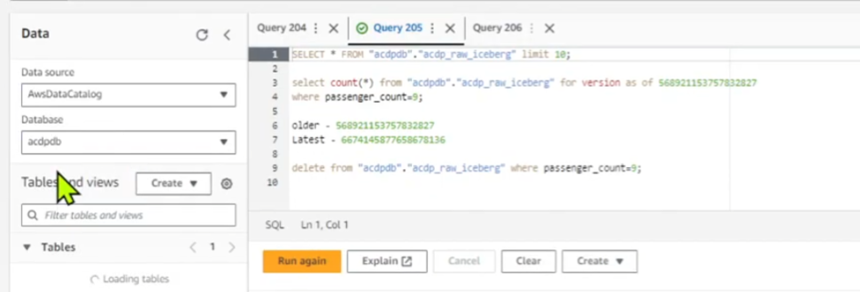


Building an ingestion architecture for Apache Iceberg  - https://www.youtube.com/watch?v=fOzHbrET7FQ

ver o lance da data_atualizacao vs data criacao, - qnts vezes a tab med muda a tabela de atualizacao... considerando ultimos 30 dias, pegamos ela not null ?

eu tenho que adicionar coluna vazia mesmo q só exista na coluna do iceberg, e nao em um dos dfs da origem?


de repente ver esse mais teorico oficial - https://www.youtube.com/watch?v=mf8Hb0coI6o


VALIDAR SCHEMA ANTES DE GRAVAR - https://github.com/developer-advocacy-dremio/definitive-guide-to-apache-iceberg/blob/main/Resources/Chapter_15/Chapter_15_2.md
Schema Validation Before Ingestion


# Add Multiple Columns:
spark.sql("""
    ALTER TABLE glue.test.employees ADD COLUMN details STRING, manager_id INT
""")
https://github.com/developer-advocacy-dremio/definitive-guide-to-apache-iceberg/blob/main/Resources/Chapter_6/Chapter6Spark.ipynb


CREATE A NEW TABLE with specific schema (to show how schema validation fails by default)
https://github.com/developer-advocacy-dremio/definitive-guide-to-apache-iceberg/blob/main/Resources/Chapter_8/ML.ipynb
Ingestion Job to insert some new data WITH explicit schema checks


Store customer records as an Iceberg table
from pyspark.sql.functions import col
customer_ice_df.writeTo("glue.dip.customers").partitionedBy(col("country")).create()
https://github.com/developer-advocacy-dremio/definitive-guide-to-apache-iceberg/blob/main/Resources/Chapter_8/SCD2.ipynb


DROPAR PARTICAO APAGA ARMAZENAMENTO?

CURTI --->>>>>>>>   https://iomete.com/the-ultimate-guide-to-apache-iceberg


schema evolution https://www.starburst.io/blog/schema-evolution/
https://iceberg.apache.org/docs/nightly/spark-writes/?h=tblproperties#schema-merge 
ALTER TABLE prod.db.sample SET TBLPROPERTIES (
  'write.spark.accept-any-schema'='true'
)
data.writeTo("prod.db.sample").option("mergeSchema","true").append()
Controlling File Sizes🔗


#########################################################
https://iceberg.apache.org/docs/nightly/docs/spark-writes/?h=#writing-with-dataframes
The behavior of each operation corresponds to SQL statements
df.writeTo(t).create() is equivalent to CREATE TABLE AS SELECT
df.writeTo(t).replace() is equivalent to REPLACE TABLE AS SELECT
df.writeTo(t).append() is equivalent to INSERT INTO
df.writeTo(t).overwritePartitions() is equivalent to dynamic INSERT OVERWRITE
aqui se precisar reprocessar
fazer umas validacoes
https://iceberg.apache.org/docs/nightly/docs/spark-writes/?h=#writing-with-dataframes
#########################################################


 Verifique se a tabela existe
if glueContext.catalog.has_table(database_name, table_name):
    print(f"A tabela {table_name} já existe no banco de dados {database_name}.")
else:
    print(f"A tabela {table_name} não existe no banco de dados {database_name}. Você pode criar aqui.")


data.writeTo("prod.db.table").overwritePartitions() - aqui se eu precisar so sobrescrever certas particoes?

https://iceberg.apache.org/docs/nightly/aws/?h=#dynamodb-lock-manager - sobre as confs aws


##### Tags and branches
spark-sql --conf spark.sql.catalog.my_catalog=org.apache.iceberg.spark.SparkCatalog \
    --conf spark.sql.catalog.my_catalog.warehouse=s3://my-bucket/my/key/prefix \
    --conf spark.sql.catalog.my_catalog.type=glue \
    --conf spark.sql.catalog.my_catalog.io-impl=org.apache.iceberg.aws.s3.S3FileIO \
    --conf spark.sql.catalog.my_catalog.s3.write.tags.my_key1=my_val1 \
    --conf spark.sql.catalog.my_catalog.s3.write.tags.my_key2=my_val2
https://iceberg.apache.org/docs/nightly/aws/?h=#hadoop-s3a-filesystem


https://tabular.io/blog/iceberg-tags-and-branches/


##### Deletes
https://docs.aws.amazon.com/athena/latest/ug/querying-iceberg-updating-iceberg-table-data.html


Esse trecho de código e a explicação associada estão relacionados ao comportamento de exclusão de objetos do Amazon S3 ao usar o Iceberg no Spark.
Quando s3.delete-enabled é definido como false, os objetos no Amazon S3 não são excluídos permanentemente (hard-deleted). Em vez disso, espera-se que essa configuração seja usada em combinação com a marcação de exclusão do S3 (S3 delete tagging), onde os objetos são marcados e removidos usando a política de ciclo de vida do S3.
A configuração s3.delete.tags é usada para adicionar tags aos objetos antes da exclusão. Essas tags podem ser usadas para configurar políticas de ciclo de vida de objetos com base nas transições de objetos para diferentes camadas de armazenamento.

No exemplo fornecido, ao iniciar o shell do Spark SQL com essas configurações, você configura o catálogo do Iceberg para adicionar tags de exclusão S3 com a chave my_key3 e o valor my_val3 antes da exclusão dos objetos. Isso pode ser útil para gerenciar a limpeza e a retenção de dados no Amazon S3 com base em políticas de ciclo de vida configuradas usando tags.
VER EM https://iceberg.apache.org/docs/nightly/aws/?h=#s3-tags S3 Tags

https://dev.to/alexmercedcoder/partitioning-practices-in-apache-hive-and-apache-iceberg-46kg


https://iceberg.apache.org/docs/nightly/docs/spark-ddl/?h=#alter-table-set-identifier-fields


##### TRBLPROPERTIES

https://iceberg.apache.org/docs/nightly/spark-ddl/?h=tblproperties#alter-table-drop-tag


SHOW TBLPROPERTIES <table_name>
SQL Commands for Apache Iceberg Tables
https://docs.dremio.com/current/reference/sql/commands/apache-iceberg-tables/show-table-properties/


query = f"""
CREATE TABLE IF NOT EXISTS glue_catalog.{std_database}.{std_table}
USING iceberg
LOCATION 's3://{std_bucket}/{std_table}'
PARTITIONED BY (id)
TBLPROPERTIES (
  'format'='parquet',
  'write_compression'='snappy'
)
AS SELECT * FROM source_df
"""
spark.sql(query)


https://www.upsolver.com/blog/apache-iceberg-tables -ver
   'write.delete.mode'='copy-on-write',
   'write.update.mode'='merge-on-read',
   'write.merge.mode'='merge-on-read'

parece maneiro - https://www.oreilly.com/library/view/apache-iceberg-the/9781098148614/ch04.html


Table Tuning for Apache Iceberg - Table Properties Explained (Course #8)  - https://www.youtube.com/watch?v=MoNGRaeJj_s

https://www.youtube.com/watch?v=MoNGRaeJj_s - Table Tuning for Apache Iceberg - Table Properties Explained (Course #8)


##### Hidden Partitioning

https://www.oreilly.com/library/view/apache-iceberg-the/9781098148614/ch04.html

##### BUCketing

The bucket transform is perfect for partitioning based on a field with high cardinality (lots of unique values). The bucket transform will use a hash function to distribute the records across a specified number of buckets. So, for example, maybe you want to partition voter data based on zip codes, but there are so many possible zip codes that you would end up with too many partitions with small datafiles. You could run something like the following:

CREATE TABLE catalog.voters (...) PARTITIONED BY bucket(24, zip) USING iceberg;
Any bucket will have several zip codes included, but at least if you look for a particular zip code, you are not doing a full table scan, just a scan of the bucket that includes the zip code you’re searching for. So, with Apache Iceberg’s hidden partitioning, you have a more expressive way to express common partitioning patterns. Taking advantage of them requires no additional thought from the end user than to filter by the fields they’d naturally filter by.
https://www.oreilly.com/library/view/apache-iceberg-the/9781098148614/ch04.html

ALTER TABLE catalog.db.students SET TBLPROPERTIES (
    'write.metadata.metrics.column.col1'='none',
    'write.metadata.metrics.column.col2'='full',
    'write.metadata.metrics.column.col3'='counts',
    'write.metadata.metrics.column.col4'='truncate(16)',
); 
=== AQUI COLETAR QUAIS COLUNAS PARA METRICAS É IMPORTANTE

Esse trecho de código está ajustando as propriedades da tabela para controlar quais métricas são coletadas para cada coluna. Isso é útil em tabelas muito amplas, onde a coleta de métricas para todas as colunas pode se tornar pesada e afetar o desempenho de leitura dos metadados.
Essencialmente, isso permite personalizar a coleta de métricas para cada coluna da tabela, permitindo um melhor controle sobre o tamanho dos metadados e o desempenho geral do sistema.


##### VACUUM

https://docs.dremio.com/current/reference/sql/commands/apache-iceberg-tables/vacuum-table


Information Schema
https://docs.dremio.com/current/reference/sql/information-schema/


from pyiceberg.catalog.glue import GlueCatalog
catalog = GlueCatalog("glue", warehouse=f"s3://...")
table = catalog.load_table("<glue db>.<table>")
print(table.metadata.metadata_log)
https://github.com/apache/iceberg/issues/6105

https://iceberg.apache.org/docs/latest/spark-ddl/#creating-a-view-with-properties


#### INSPECTION
https://iomete.com/resources/blog/cheat-sheet-for-apache-iceberg
https://iomete.com/resources/assets/files/iceberg-cheat-sheet-302e17d53873b43de7f8a925d2a3ed7f.pdf


https://medium.com/snowflake/creating-and-managing-apache-iceberg-tables-using-serverless-features-and-without-coding-14d2198cf5b5
https://iceberg.apache.org/spec/#position-delete-files


### DATA OBSERVABILITY COM ICEBERG
https://tabular.io/blog/integrated-audits/


### Sheets

https://tabular.io/wp-content/uploads/2024/01/tabular_iceberg-spark_cheat-sheet-1.pdf
https://tabular.io/videos/


https://www.youtube.com/watch?v=iGvj1gjbwl0 - tem esse iceberg com athena

https://www.dremio.com/blog/apache-iceberg-101-your-guide-to-learning-apache-iceberg-concepts-and-practices/ dremio alguns posts
por exemplo table evolution https://iceberg.apache.org/docs/latest/evolution/

particionamento post iceberg - https://www.linkedin.com/pulse/partitioning-practices-apache-hive-iceberg-alex-merced-hhgke/

sobre catalogo? https://www.linkedin.com/pulse/understanding-future-apache-iceberg-catalogs-alex-merced-obxyc/


https://www.linkedin.com/pulse/apache-iceberg-tables-aws-athena-tom-reid/ AQUI TERIA QUE VER


# data quality mudar de lugar 
https://www.youtube.com/watch?v=wvUiRHd47M0