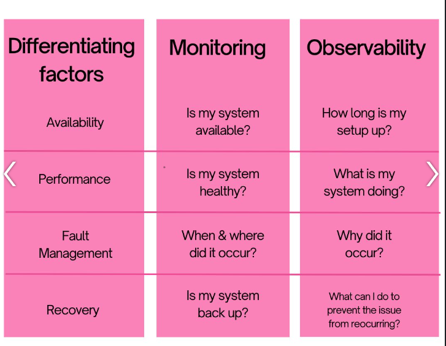
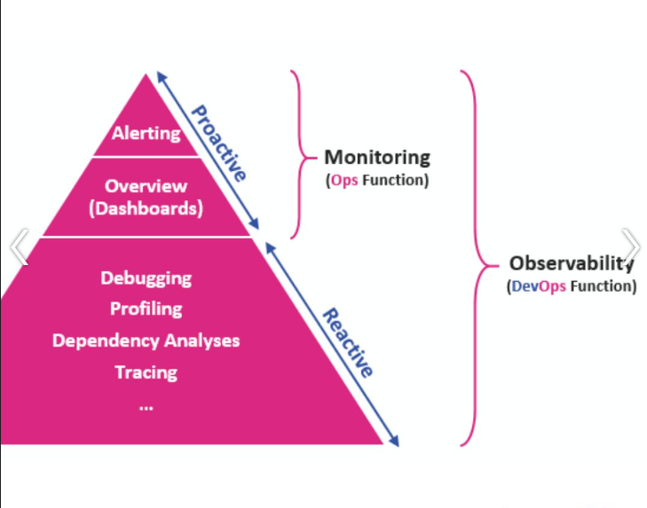

O monitoramento serve como um painel para acompanhar métricas, como:
Auxilia a detectar problemas precocimente.

As ferramentas de monitoramento também alerta quando algo não sai como esperado.

Agora a observabilidade permite como as coisas estao acontecendo, ajudam a diagnosticar o problema.
Fornece insights, por meio de logs, metricas, rastreamentos,

Monitoring:
- Availability
- Performance
- Capacity

Observability
- Metrics
- Traces
- Logs

Monitoring está dentro de Observability

Monitoring:

- Notifies you that a system is at fault
- Focuses on monitoring the systems && discovering faults
- Focuses on collecting data
- Fofuses on monitoring KPIs
- Monitoring as a single plane
- It gives you limited information
- Monitoring is the process of using observability

Observability:

- Tells you why a system is at fault
- Acts as a knowledge base in defining what to monitor
- Focuses on giving context to the data
- Gives a more complete assessment of the overall environment
- Observability is a traversable map
- It gives you complete information
- It has the pontential to monitor different events
  

এই নমুনা পোস্টটি এই বিষয়গুলো পরীক্ষা করার জন্যে করা হয়েছেঃ

- বিভাগ, উপ-বিভাগে সাইডবারে একটির ভেতর আরেকটি কিভাবে আছে সেটা দেখা।
- হেরো ছবিটি পোস্ট যে পথে আছে সে পথে `images` ফোল্ডার এ থাকবে।
- বিভিন্ন মিডিয়া যেমন ছবি, টুইট, ইউটিউব ভিডিও, ভীমেও ভিডিও ইত্যাদি রেন্ডারিং।

### ছবির নমুনা





### টুইটের নুমুনা





### ইউটিওবের ভিডিও নমুনা





### ভীমেও ভিডিও নমুনা


